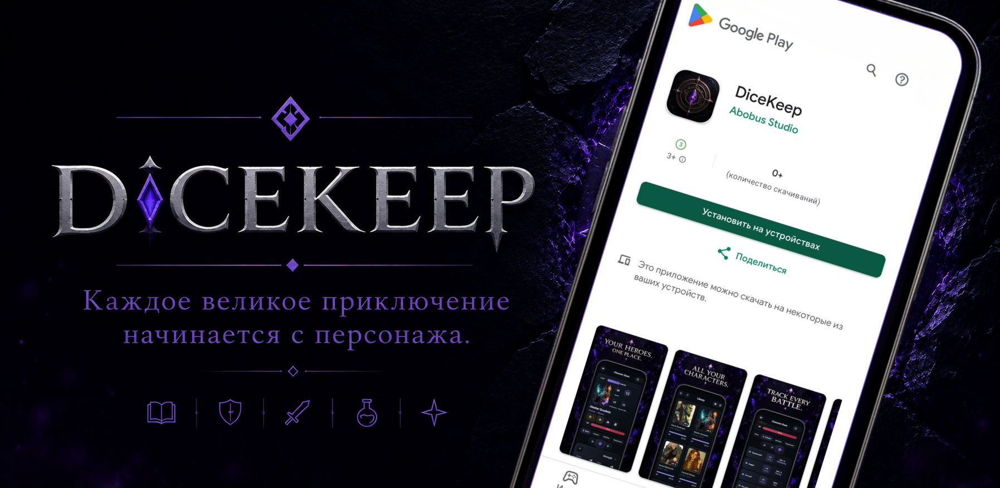

# Daniel Glukhov

### Senior UX/UI Designer
### Flutter Developer

Проектирую и разрабатываю мобильные приложения, объединяя UX/UI-дизайн и Flutter-разработку.

[LinkedIn](https://www.linkedin.com/in/daniel-g-39664823b/) • [DiceKeep Website](https://danielglukhov.github.io/dicekeep-pages)

---

## О себе

Более 7 лет занимаюсь проектированием цифровых продуктов, от банковских сервисов и CRM-систем до enterprise-платформ.

Сегодня основной фокус моей работы - разработка мобильных приложений на Flutter. Опыт в UX/UI помогает принимать инженерные решения с учетом пользовательского опыта, а опыт разработки - проектировать интерфейсы, понимая их техническую реализацию.

Мне важно создавать продукты, в которых дизайн и разработка работают как единая система.

---

  

---

## Featured Project

### DiceKeep

Мобильное приложение для игроков в настольные RPG.

**Статус:** Google Play Closed Testing.

DiceKeep - проект, в котором я самостоятельно отвечаю за весь цикл разработки мобильного продукта: от идеи и проектирования пользовательского опыта до реализации на Flutter, тестирования и подготовки к публикации.

Этот проект стал для меня возможностью объединить опыт UX/UI-дизайна и мобильной разработки, проверяя архитектурные, продуктовые и UX-решения в реальном приложении.
